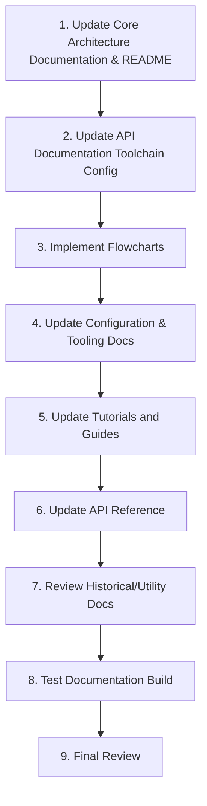
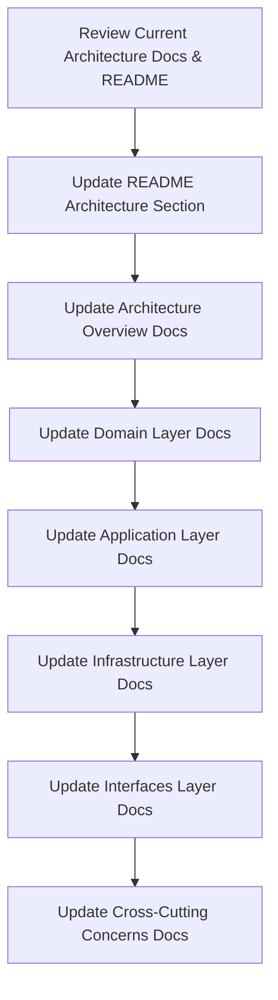
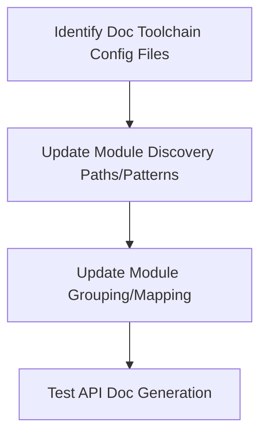
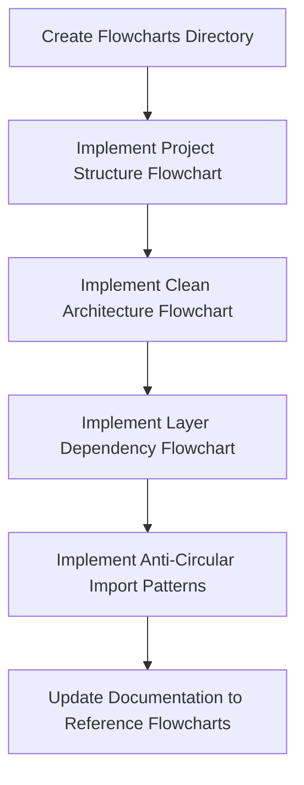
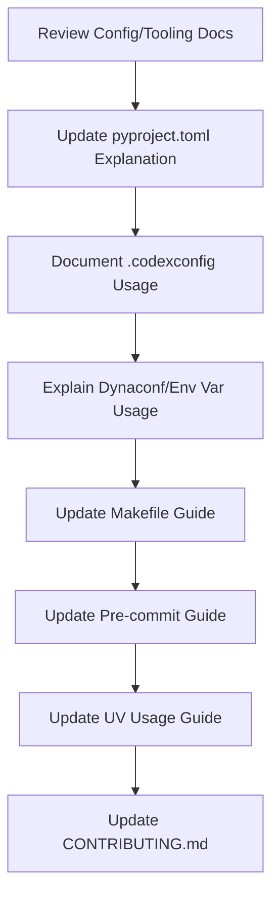
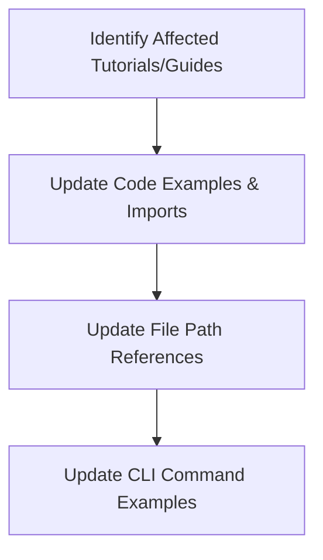
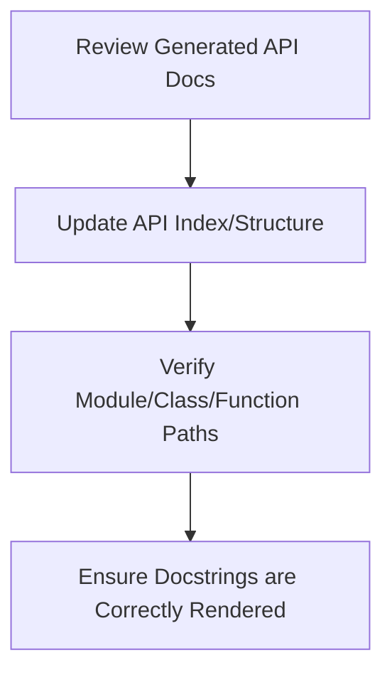
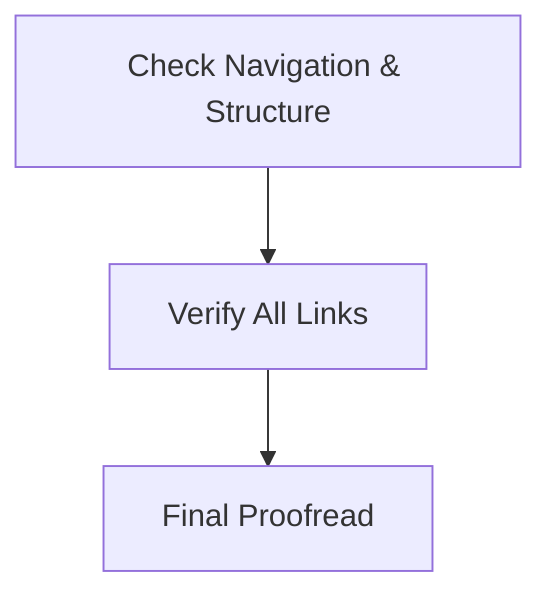

Okay, CodeArchitect, incorporating those changes and removing the `memory-bank` documentation, here is the updated `documentation_refactoring_plan.md`:

---

# Documentation Refactoring Plan for The AIchemist Codex (Revised)

## Overview

This document outlines the plan for updating the documentation of The AIchemist Codex project to reflect the refactored architecture. The project has been refactored to follow a clean architecture approach with domain, application, infrastructure, and interfaces layers, but the documentation still references the old file paths and module structure in some places (notably the main `README.md`).

## Goals

1. Update documentation to accurately reflect the current clean architecture structure (`domain/`, `application/`, `infrastructure/`, `interfaces/`, `cross_cutting/`).
2. Ensure the main `README.md` accurately describes the current architecture.
3. Prioritize architecture and core documentation updates.
4. Add flowcharts to visualize project structure and prevent circular imports.
5. Ensure all code examples and references use the correct paths and imports.
6. Update configuration and tooling documentation.
7. Maintain consistency across all documentation.
8. Review and handle historical documentation (`README_migration.md`).
9. Review and document utility directories (`bin/`, `config/`) if necessary.

## Prioritized Implementation Plan



### 1. Update Core Architecture Documentation & README (Priority) [DONE]

The architecture documentation and main README need to accurately reflect the current implementation:



#### Specific Tasks

- **Review Current Architecture Docs & README**: Review `README.md` and all files in `docs/architecture/` to identify outdated content.
- **Update README Architecture Section**: Correct the architecture description in the main `README.md` to match the actual implemented layers (`domain`, `application`, `infrastructure`, `interfaces`, `cross_cutting`).
- **Update Architecture Overview**: Update `docs/architecture/overview.rst` to reflect the clean architecture implementation.
- **Update Layer-Specific Docs**: Update the documentation for each layer:
  - `docs/architecture/domain_layer.rst`
  - `docs/architecture/application_layer.rst`
  - `docs/architecture/infrastructure_layer.rst` (Ensure coverage of `infrastructure/utils/`)
  - `docs/architecture/interfaces_layer.rst`
- **Update Cross-Cutting Concerns**: Add or update documentation for cross-cutting concerns (covering `cross_cutting/` and relevant parts of `infrastructure/utils/`).

#### Key Changes for Architecture Documentation

- Update file paths and import statements to reflect the new structure.
- Update component descriptions to match the current implementation.
- Ensure all diagrams and visual representations match the current architecture.
- Add examples that demonstrate the proper use of each layer.
- Document the boundaries and responsibilities of each layer.

### 2. Update API Documentation Toolchain Configuration

The documentation toolchain (likely MkDocs/Sphinx with Mkdocstrings) needs configuration updates to discover and document modules correctly from the new structure:



#### Specific Tasks

- **Identify Config Files**: Locate the primary configuration files (e.g., `mkdocs.yml`, `docs/conf.py`).
- **Update Discovery Paths**: Ensure the toolchain scans the correct directories within `src/the_aichemist_codex/`.
- **Update Grouping/Mapping**: Adjust the configuration (like the `modules` dictionary concept, but applied to the toolchain's settings) to group documentation logically based on the clean architecture layers:

    ```python
    # Conceptual Mapping for Toolchain Configuration
    modules: dict[str, list[str]] = {
        "domain": ["entities", "value_objects", "repositories", "services", "events", "exceptions"],
        "application": ["use_cases", "commands", "queries", "dto", "mappers", "services", "validators"],
        "infrastructure": ["repositories", "persistence", "messaging", "search", "config", "security", "ai", "utils"], # Note: utils added
        "interfaces": ["api", "cli", "events", "stream", "presenters"],
        "cross_cutting": ["logging", "error_handling", "security", "validation", "telemetry"],
    }
    ```

- **Update Module Descriptions**: Update any manual descriptions if present in the config.
- **Test API Doc Generation**: Run the build process (`make docs` or similar) to ensure it generates the correct API documentation without errors.

### 3. Implement Flowcharts (New Section)

Add a new section to the documentation with flowcharts visualizing the architecture:



#### Specific Tasks

- **Create Flowcharts Directory**: Create `docs/flowcharts/`.
- **Implement Flowcharts**: Create Mermaid (`.mmd`) or similar files for:
  - Overall project structure.
  - Clean architecture layers and interactions.
  - Layer dependencies (following the dependency rule).
  - Patterns demonstrating correct dependency flow (e.g., Dependency Inversion) to avoid circular imports.
- **Update Documentation**: Link to these flowcharts from relevant architecture pages.

### 4. Update Configuration & Tooling Docs

Ensure documentation accurately reflects how to configure the project and use development tools:



#### Specific Tasks

- **Review Config/Tooling Docs**: Check `README.md`, `CONTRIBUTING.md`, and any guides mentioning configuration or development setup.
- **Document `pyproject.toml`**: Explain the consolidated configuration approach, key sections (`[project]`, `[tool.ruff]`, `[tool.mypy]`, etc.).
- **Document `.codexconfig`**: Explain the purpose and settings within this file (if it remains relevant after potential `dynaconf` integration mentioned in `pyproject.toml`).
- **Document Env Vars/Secrets**: Explain how environment variables (e.g., `AICHEMIST_ROOT`, `AICHEMIST_DATA_DIR`) and potentially secure configurations (`infrastructure/config/security/`) work.
- **Update `Makefile` Guide**: Ensure `make` commands are documented and accurate.
- **Update `pre-commit` Guide**: Explain setup (`pre-commit install`) and usage (`pre-commit run`).
- **Update `uv` Usage**: Explain how `uv` is used for dependency management (`uv sync`, `uv pip install`).
- **Update `CONTRIBUTING.md`**: Ensure the contribution workflow reflects the current tools and practices.

### 5. Update Tutorials and Guides

Update existing tutorials and guides, including specific READMEs, for correctness:



#### Specific Tasks

- **Identify Affected Docs**: Review `docs/tutorials/*`, `docs/guides/*`, `README-search.md`, `README-tagging-relationships.md`.
- **Update Code Examples/Imports**: Correct any Python code snippets to use valid imports from the new structure.
- **Update File Paths**: Correct references to file locations.
- **Update CLI Examples**: Ensure commands shown in guides match the current CLI implementation.

### 6. Update API Reference

Update the generated API reference documentation:



#### Specific Tasks

- **Review API Docs**: Check the output generated by the documentation toolchain (MkDocs/Sphinx).
- **Update Index/Structure**: Ensure the API documentation structure reflects the new layers.
- **Verify Paths**: Check that links and references point to the correct modules, classes, and functions.
- **Verify Docstrings**: Ensure docstrings are parsed and displayed correctly.

### 7. Review Historical/Utility Docs

Assess and document other relevant parts of the project:

```mermaid
graph TD
    A[Review README_migration.md] --> B[Decide Action (Update/Archive/Remove)]
    B --> C[Investigate bin/ Directory]
    C --> D[Document bin/ Scripts (if needed)]
    D --> E[Investigate config/ Directory]
    E --> F[Document config/ Contents (if needed)]
```

#### Specific Tasks

- **Review `README_migration.md`**: Determine if this historical document is still needed. If so, update it for clarity or archive it. If not, remove it.
- **Investigate `bin/`**: Understand the purpose of scripts in `bin/`. Document any scripts intended for user or developer use.
- **Investigate `config/`**: Understand the purpose of files in `config/`. Document any user-configurable templates or files not covered by the main configuration docs.

### 8. Test Documentation Build

Thoroughly test the documentation build process:

```mermaid
graph TD
    A[Run Full Documentation Build] --> B[Check for Build Warnings/Errors]
    B --> C[Verify Content Accuracy and Links]
    C --> D[Test Local Serving (if applicable)]
```

#### Specific Tasks

- **Run Full Build**: Execute the primary command to build all documentation (e.g., `make docs`).
- **Check Build Output**: Look for warnings (broken links, missing references) and errors.
- **Verify Content**: Spot-check generated pages for accuracy, correct paths, and working code examples. Click through links.
- **Test Local Serving**: If using MkDocs or similar, test `mkdocs serve` to ensure local viewing works.

### 9. Final Review

Perform a final quality check:



#### Specific Tasks

- **Check Navigation**: Ensure the overall site structure and navigation are logical.
- **Verify Links**: Perform a final check on internal and external links.
- **Proofread**: Read through key sections for clarity, consistency, and correctness.

## Implementation Timeline (Estimate - Adjust as Needed)

1. **Core Architecture Docs & README**: 2-3 days
2. **API Doc Toolchain Config**: 1 day
3. **Flowcharts Implementation**: 1-2 days
4. **Configuration & Tooling Docs**: 1-2 days
5. **Tutorials and Guides**: 2-3 days
6. **API Reference**: 1-2 days
7. **Review Historical/Utility Docs**: 0.5-1 day
8. **Testing and Review**: 1-2 days

Total estimated time: 9.5 - 16 days

## Conclusion

This revised plan provides a comprehensive approach to updating the documentation for The AIchemist Codex project, aligning it with the refactored clean architecture and addressing configuration, tooling, and utility aspects. It removes references to the scrapped `memory-bank` system. By following these steps, the documentation will accurately reflect the current implementation and serve as a valuable resource.

---
