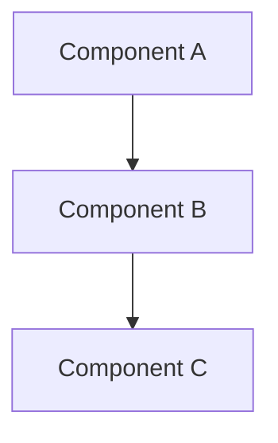

# {{title}}

## Design Overview

Brief description of the design.

## Problem Statement

Clear statement of the problem being solved.

## Goals and Non-Goals

### Goals
- Goal 1
- Goal 2

### Non-Goals
- Non-goal 1
- Non-goal 2

## Design Details

### System Context
High-level system context and interactions.

### Architecture

### Components
Detailed component descriptions.

### Data Flow
Description of data flow through the system.

### APIs and Interfaces
Key APIs and interface definitions.

## Design Considerations

### Trade-offs
- Trade-off 1
- Trade-off 2

### Alternatives Considered
- Alternative 1
- Alternative 2

### Performance
Performance considerations and requirements.

### Security
Security considerations and requirements.

### Scalability
Scalability considerations and approach.

## Implementation Strategy

### Phase 1
- Implementation step 1
- Implementation step 2

### Phase 2
- Implementation step 1
- Implementation step 2

## Testing Strategy
Approach to testing the design.

## Open Questions
- Question 1
- Question 2

## Related Designs
- [[Link to related design]]

## References
- Reference 1
- Reference 2

## Backlinks
