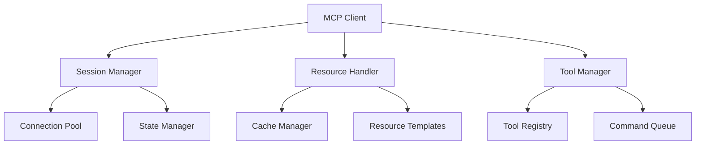

# MCP Client Development Guide

> **TL;DR:** Comprehensive guide for developing MCP clients, including best practices, patterns, and integration strategies.

## Client Architecture

### Core Components



## Implementation Patterns

### 1. Basic Client Setup

```python
from mcp.client import MCPClient
from mcp.types import ClientConfig
from mcp.shared.context import Context

async def create_client():
    config = ClientConfig(
        server_url="ws://localhost:8080",
        timeout=30,
        max_retries=3,
        connection_pool_size=5
    )

    context = Context(
        project="aichemist",
        environment="development"
    )

    return MCPClient(config, context)
```

### 2. Session Management

```python
async def managed_session():
    async with MCPClient() as client:
        await client.connect()

        # Register session handlers
        client.on_connect(handle_connect)
        client.on_disconnect(handle_disconnect)
        client.on_error(handle_error)

        return client

async def handle_connect():
    logger.info("Connected to MCP server")

async def handle_disconnect():
    logger.info("Disconnected from MCP server")

async def handle_error(error):
    logger.error(f"MCP error: {error}")
```

### 3. Resource Handling

```python
from mcp.client.resources import ResourceManager

class CustomResourceManager(ResourceManager):
    async def get_resource(self, path: str) -> Resource:
        # Check cache first
        if cached := await self.cache.get(path):
            return cached

        # Fetch from server
        resource = await self.client.request(
            "get_resource",
            parameters={"path": path}
        )

        # Cache for future use
        await self.cache.set(path, resource)
        return resource
```

## Advanced Features

### 1. Streaming Support

```python
async def stream_large_resource(client, path: str):
    async for chunk in client.stream(
        "stream_resource",
        parameters={"path": path}
    ):
        yield chunk
```

### 2. Batch Operations

```python
async def batch_process(client, operations: list[dict]):
    async with client.batch() as batch:
        for op in operations:
            batch.add_request(
                op["command"],
                parameters=op["params"]
            )
    return await batch.execute()
```

### 3. Event Handling

```python
from mcp.client.events import EventHandler

class CustomEventHandler(EventHandler):
    async def on_resource_update(self, event):
        # Handle resource update event
        await self.refresh_cache(event.resource_id)

    async def on_server_status(self, event):
        # Handle server status updates
        self.update_health_metrics(event.status)
```

## Performance Optimization

### 1. Connection Pooling

```python
from mcp.client.pool import ConnectionPool

pool = ConnectionPool(
    max_size=10,
    min_size=2,
    max_idle=300
)

async def get_connection():
    async with pool.acquire() as conn:
        return conn
```

### 2. Caching Strategy

```python
from mcp.client.cache import Cache

cache = Cache(
    max_size=1000,
    ttl=3600,
    strategy="lru"
)

async def cached_request(client, command, params):
    cache_key = f"{command}:{hash(str(params))}"

    if cached := await cache.get(cache_key):
        return cached

    result = await client.request(command, params)
    await cache.set(cache_key, result)
    return result
```

## Error Handling

### 1. Retry Logic

```python
from mcp.shared.retry import RetryStrategy

retry_strategy = RetryStrategy(
    max_attempts=3,
    backoff_factor=1.5,
    max_backoff=30
)

@retry_strategy.wrap
async def reliable_request(client, command, params):
    return await client.request(command, params)
```

### 2. Circuit Breaker

```python
from mcp.client.circuit_breaker import CircuitBreaker

breaker = CircuitBreaker(
    failure_threshold=5,
    reset_timeout=60
)

async def protected_request(client, command, params):
    async with breaker:
        return await client.request(command, params)
```

## Testing Strategies

### 1. Mock Client

```python
from mcp.testing import MockMCPClient

async def test_resource_fetch():
    client = MockMCPClient()
    client.add_response(
        "get_resource",
        Resource(content="test", metadata={})
    )

    result = await client.request("get_resource", {"path": "test"})
    assert result.content == "test"
```

### 2. Integration Testing

```python
async def test_live_client():
    async with MCPClient() as client:
        # Test real server interaction
        response = await client.request(
            "memory_search",
            {"query": "test"}
        )
        assert response.status == 200
```

## Security Best Practices

### 1. Authentication

```python
from mcp.client.auth import TokenAuth

auth = TokenAuth(token="your-api-key")
client = MCPClient(auth=auth)
```

### 2. Secure Communication

```python
config = ClientConfig(
    server_url="wss://secure.example.com",
    ssl_context=create_ssl_context(),
    verify_ssl=True
)
```

## Cross-References

- [[mcp-overview]]: General MCP concepts
- [[mcp-implementation]]: Server-side implementation
- [[mcp-servers]]: Available servers
- [[systemPatterns]]: Integration patterns

## Version History

| Version | Date | Changes |
|---------|------|---------|
| 1.0.0 | 2025-03-28 | Initial documentation |

## Backlinks

- [[mcp-overview]]
- [[mcp-implementation]]
- [[mcp-servers]]
- [[systemPatterns]]
