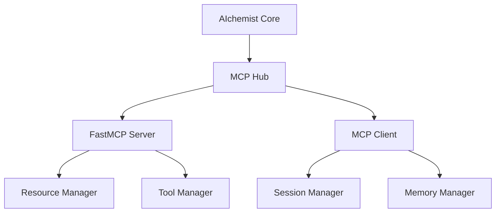

# MCP Technical Implementation Guide

> **TL;DR:** Detailed technical specifications and implementation patterns for integrating the Model Context Protocol (MCP) into the AIchemist system.

## Architecture Overview

### Component Structure



## Implementation Details

### 1. Environment Setup

```bash
# Create virtual environment
python -m venv .venv
source .venv/bin/activate  # Unix
.\.venv\Scripts\activate   # Windows

# Install dependencies using uv
uv add mcp-python-sdk
uv add fastmcp
```

### 2. Server Implementation

#### Basic Server

```python
from mcp.server.fastmcp import FastMCPServer
from mcp.types import Resource, ResourceMetadata

class AIchemistMCPServer(FastMCPServer):
    async def initialize(self) -> None:
        """Initialize server resources and tools."""
        await self.register_tools()
        await self.load_resources()

    async def get_resource(self, path: str) -> Resource:
        """Retrieve a resource by path."""
        metadata = ResourceMetadata(
            mime_type="text/markdown",
            encoding="utf-8"
        )
        content = await self.read_resource(path)
        return Resource(content=content, metadata=metadata)

    async def list_directory(self, path: str) -> list[str]:
        """List contents of a directory."""
        return await self.scan_directory(path)
```

### 3. Client Integration

#### Session Management

```python
from mcp.client import MCPClient
from mcp.types import ClientConfig

async def create_mcp_session():
    config = ClientConfig(
        server_url="ws://localhost:8080",
        timeout=30
    )

    async with MCPClient(config) as client:
        await client.connect()
        return client

async def execute_mcp_command(client, command, params):
    try:
        response = await client.request(command, parameters=params)
        return response
    except Exception as e:
        logger.error(f"MCP command failed: {e}")
        raise
```

### 4. Resource Management

#### Resource Templates

```python
from mcp.server.fastmcp.resources import ResourceTemplate

memory_template = ResourceTemplate(
    name="memory",
    description="Memory bank resource",
    parameters={
        "path": {
            "type": "string",
            "description": "Path to memory file"
        }
    }
)
```

### 5. Tool Integration

#### Tool Registration

```python
from mcp.server.fastmcp.tools import Tool

@server.tool("memory_search")
async def search_memory(query: str) -> list[str]:
    """Search through memory bank files."""
    results = []
    # Implementation
    return results
```

## Error Handling

### 1. Exception Chaining

```python
from mcp.shared.exceptions import MCPError

class MemoryAccessError(MCPError):
    """Error accessing memory bank files."""
    pass

try:
    # Memory operation
    pass
except FileNotFoundError as e:
    raise MemoryAccessError("Memory file not found") from e
```

### 2. Error Recovery

```python
async def with_retry(func, max_retries=3):
    """Execute function with retries."""
    for attempt in range(max_retries):
        try:
            return await func()
        except MCPError as e:
            if attempt == max_retries - 1:
                raise
            await asyncio.sleep(1 * (attempt + 1))
```

## Testing Patterns

### 1. Server Tests

```python
import pytest
from mcp.testing import MCPTestClient

async def test_memory_server():
    async with MCPTestClient() as client:
        response = await client.request(
            "memory_search",
            parameters={"query": "test"}
        )
        assert response.status == 200
```

### 2. Integration Tests

```python
async def test_memory_integration():
    server = AIchemistMCPServer()
    await server.start()

    try:
        # Test implementation
        pass
    finally:
        await server.stop()
```

## Performance Considerations

1. **Connection Management**
   - Use connection pooling
   - Implement proper cleanup
   - Handle timeouts appropriately

2. **Resource Optimization**
   - Cache frequently accessed resources
   - Use streaming for large files
   - Implement proper memory management

3. **Concurrency**
   - Use asyncio for concurrent operations
   - Implement proper locking mechanisms
   - Handle race conditions

## Security Guidelines

1. **Authentication**
   - Implement proper token validation
   - Use secure communication channels
   - Validate all input parameters

2. **Resource Access**
   - Implement proper access controls
   - Validate file paths
   - Prevent directory traversal

## Cross-References

- [[mcp-overview]]: General MCP overview
- [[systemPatterns]]: Related architectural patterns
- [[techContext]]: Technical context and decisions

## Version History

| Version | Date | Changes |
|---------|------|---------|
| 1.0.0 | 2025-03-28 | Initial technical documentation |
